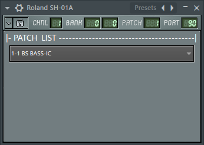
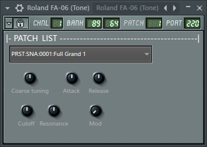
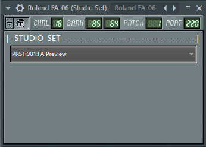
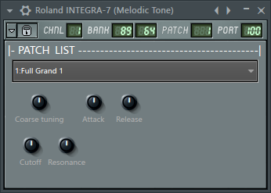
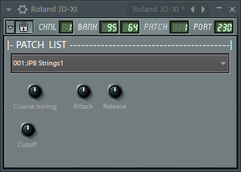
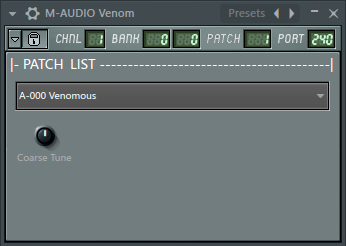

# Коллекция полезностей для FL Studio

## Installation instructions:

Download the .zip file... unpack.

1) Place folders from `Artwork` into:
   `[your Image-Line folder]/[your FL Studio folder]/Plugins/Fruity/Generators/Dashboard/Artwork/`

2) Place files from `Dashboard` into:
   `[your Image-Line folder]/[your FL Studio folder]/Data/Patches/Plugin presets/Generators/Dashboard/`

## Пресеты Dashboard

### Roland JP-08

автор: ReSampled

  

### Roland SE-02 

author: penneyfour from forum.image-line.com

### Roland SH-01A (patchlist only)

author: ReSampled

### Roland FA-06/07/08 (Tones, patchlist only)

author: ReSampled

### Roland FA-06/07/08 (Studio Set, patchlist only)

author: ReSampled

### Roland INTEGRA-7 (Tones, patchlist only)

author: ReSampled

### Roland JD-XI (patchlist only)

author: ReSampled

### M-AUDIO Venom (patchlist only)

author: ReSampled

## Пресеты MIDI Out

### Установка

Скачайте файл пресета и поместите в `[папка Image-Line]/[папка FL Studio]/Data/Patches/Plugin presets/Generators/MIDI Out/`.

### Пресеты

* <a href="MIDI Out/Behringer DeepMind 12.fst?raw=true">Behringer DeepMind 12</a>
* <a href="MIDI Out/Behringer Model D.fst?raw=true">Behringer Model D</a>
* <a href="MIDI Out/Korg Minilogue.fst?raw=true">Korg Minilogue</a>
* <a href="MIDI Out/Roland FA-06.fst?raw=true">Roland FA-06</a>
* <a href="MIDI Out/Roland INTEGRA-7.fst?raw=true">Roland INTEGRA-7</a>
* <a href="MIDI Out/Roland JD-XI (Analog).fst?raw=true">Roland JD-XI (Analog)</a>
* <a href="MIDI Out/Roland JD-XI (Drums).fst?raw=true">Roland JD-XI (Drums)</a>
* <a href="MIDI Out/Roland JD-XI (SuperNATURAL).fst?raw=true">Roland JD-XI (SuperNATURAL)</a>
* <a href="MIDI Out/Roland MC-707.fst?raw=true">Roland MC-707</a>
* <a href="MIDI Out/Roland SE-02.fst?raw=true">Roland SE-02</a>
* <a href="MIDI Out/Roland TB-03.fst?raw=true">Roland TB-03</a>

## Пресеты Control Surface

* <a href="Control Surface/BlendTwoInstruments.fst?raw=true">BlendTwoInstruments</a>
* <a href="Control Surface/General MIDI mixer (16Ch).fst?raw=true">General MIDI mixer (16Ch)</a>
* <a href="Control Surface/General MIDI mixer (1Ch).fst?raw=true">General MIDI mixer (1Ch)</a>
* <a href="Control Surface/General MIDI mixer (8Ch).fst?raw=true">General MIDI mixer (8Ch)</a>
* <a href="Control Surface/Roland JD-XI mixer.fst?raw=true">Roland JD-XI mixer</a>

