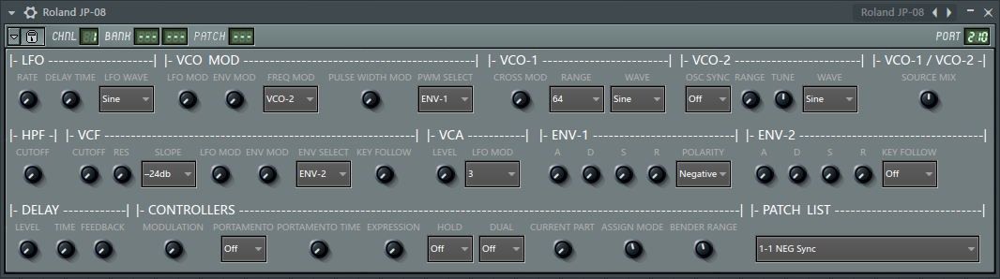
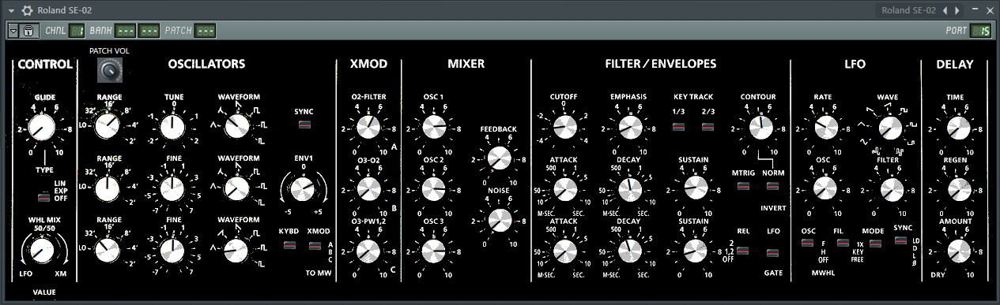
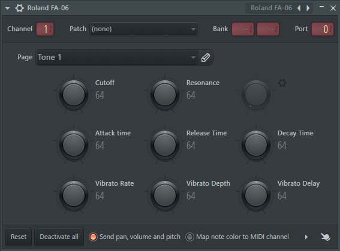

# FL Studio MIDI Dashboards

## Installation instructions:

Download the .zip file... unpack.

1) Place folders from `Artwork` into:
   `[your Image-Line folder]/[your FL Studio folder]/Plugins/Fruity/Generators/Dashboard/Artwork/`

2) Place files from `Dashboard` into:
   `[your Image-Line folder]/[your FL Studio folder]/Data/Patches/Plugin presets/Generators/Dashboard/`

3) Place files from `MIDI Out` into:
   `[your Image-Line folder]/[your FL Studio folder]/Data/Patches/Plugin presets/Generators/MIDI Out/`

## Dashboard presets

### Roland JP-08

author: ReSampled

  

### Roland SE-02 

author: penneyfour from forum.image-line.com

### Roland SH-01A (patchlist only)

author: ReSampled

### M-AUDIO Venom (patchlist only)

author: ReSampled

## MIDI Out presets

### Roland FA-06/07/08

